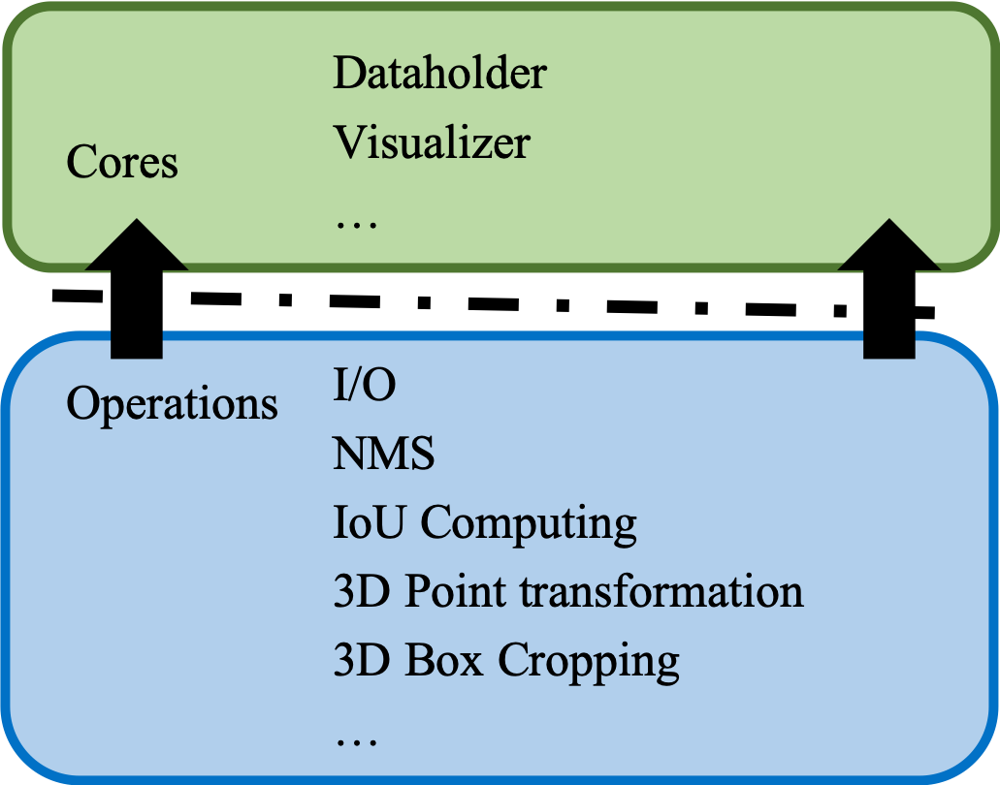

# det3

This repo is a LiDAR-based 3D object detection code base.
It provides some basic operations and methods for 3D object detection.
The architecture of the det3 project is as follows:

<p align="center">

</p>

## Requirements

- python 3.7.3
- CUDA 10.1+
- PyTorch 1.4.0+
- Open3D 0.9

## Dockerfile

```sh
cd dockerfiles
docker build . -t <dockerimage-tag>/det3:v0.1
docker run -it --name det3 --gpus all <dockerimage-tag>/det3:v0.1
```

## Usage

You can call the functions of det3 as a package. It provides basic functions in **det3.dataloader**, **det3.ops**, and **det3.visualizer** with detailed documentation inline. The inline documentation of each function explains itself.

The det3 also provides a use case of SECONDNet in **det3/methods/second**. You can refer to this implementation for its usage.

We will also provide more detailed tutorials in the future.

## Acknowledgement

- [second.pytorch](https://github.com/traveller59/second.pytorch)
- [spconv](https://github.com/traveller59/spconv)
- [kitt_eval](https://github.com/prclibo/kitti_eval)

Thanks for the contribution of predecessors in this field.
If you find any inappropriate references in this code base,
please feel free to contact us (pyun@ust.hk).
